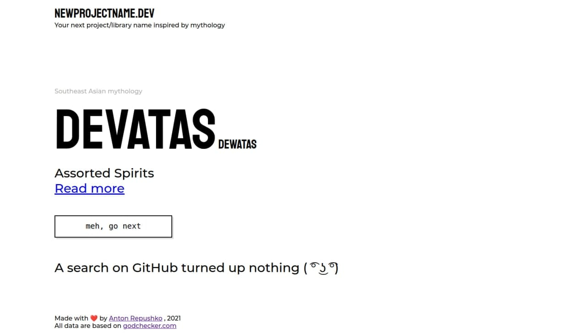

# [newprojectname.dev](https://newprojectname.dev)

---

This is the Svelte app, made by not a frontend engineer (me) with love in January 2021.

### Install dependencies

```
npm install
```

### Local run
```
npm run dev
```

### Production build
```
npm run build
```